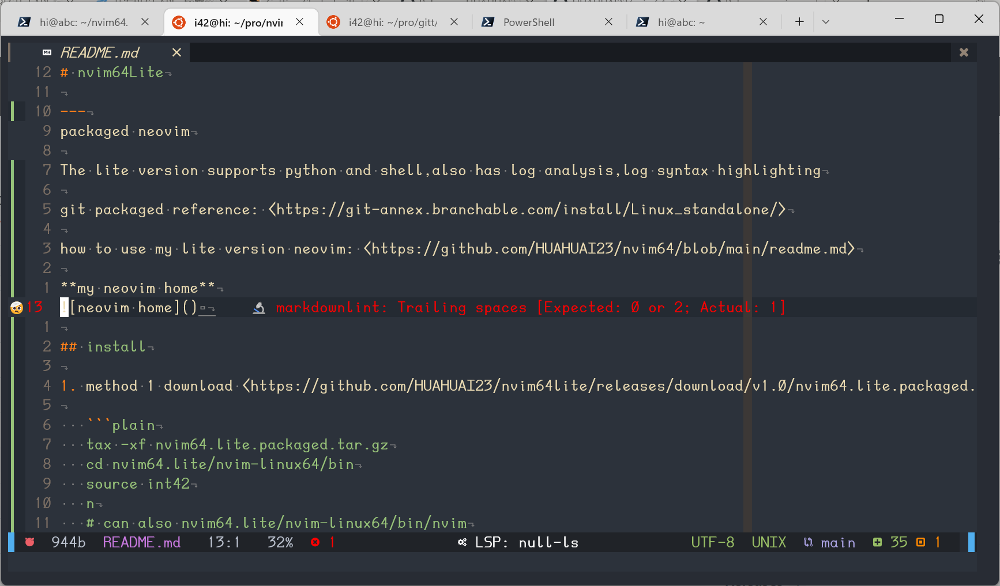
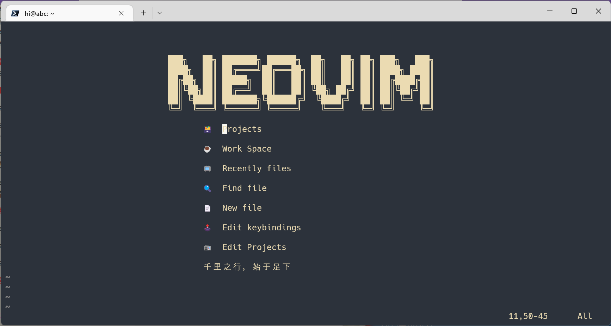

# nvim64Lite

---
packaged neovim

The lite version supports python and shell,also has log analysis,log syntax highlighting

git packaged reference: <https://git-annex.branchable.com/install/Linux_standalone/>

how to use my lite version neovim: <https://github.com/HUAHUAI23/nvim64/blob/main/readme.md>

**my neovim home**



## install

1. method 1 download <https://github.com/HUAHUAI23/nvim64lite/releases/download/v1.0/nvim64.lite.packaged.tar.gz>

   ```plain
   tax -xf nvim64.lite.packaged.tar.gz
   cd nvim64.lite/nvim-linux64/bin
   source int42
   n
   # can also nvim64.lite/nvim-linux64/bin/nvim
   ```

2. method 2 download <https://github.com/HUAHUAI23/nvim64lite/releases/download/v1.0/nvim64.lite.tar>

   ```plain
   tar -xf nvim64.lite.tar
   cd  nvim64.lite
   bash initial.sh
   rm -rf trush
   cd nvim-linux64/bin/
   source int42.sh

   ```

---
ultimate neovim ide: <https://github.com/HUAHUAI23/nvim64>
